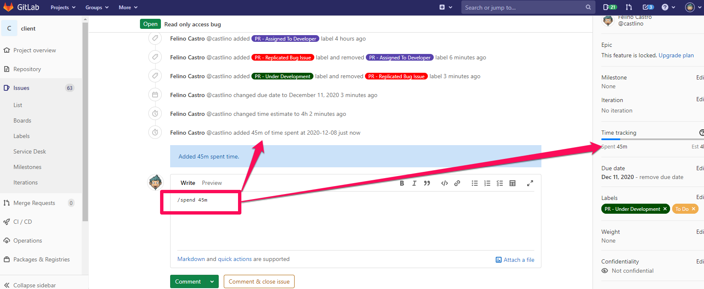
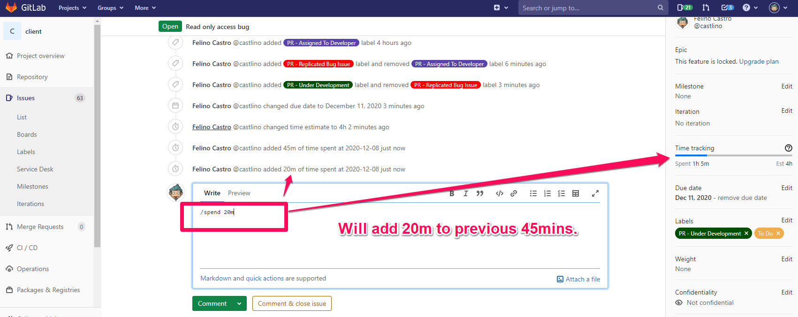

# GitlabDocs

Below is just the basic usage of adding time spent and estimate to a gitlab issues, if you want to learn more [click here](https://docs.gitlab.com/ee/user/project/time_tracking.html)

## To add estimate to gitlab issues assigned to a developer, write it as a comment as below.
>ex: "/estimate 4h" for 4 hours.

## To add time spent to gitlab issues, write it as a comment as below.
>ex: "/spend 45m" for 45 minutes.

## Adding succeeding time spent will just add it to the total entries of time spent, see example below.
>ex: "/spend 20m" for 20 minutes.

