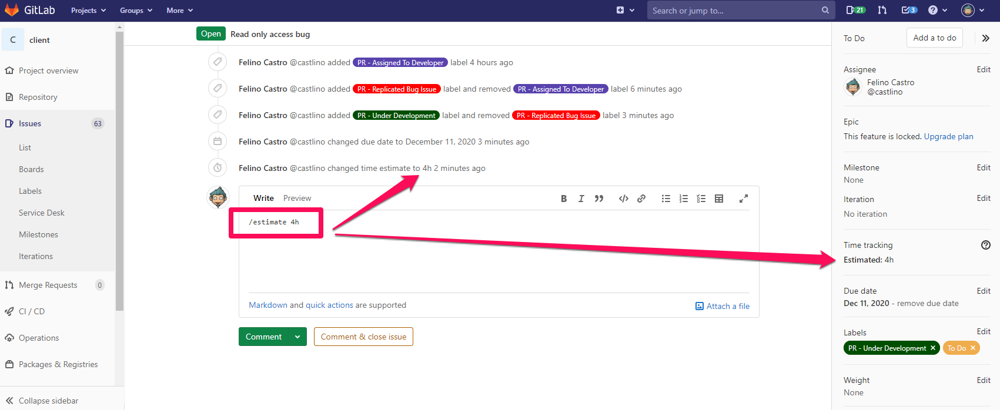

# GitlabDocs

## To add estimate to gitlab issues assigned to a developer, you just need to write it as a comment.
>ex: "/estimate 4h" for 4 hours.

## To add estimate to gitlab issues assigned to a developer, you just need to write it as a comment.
>ex: "/estimate 4h" for 4 hours.

